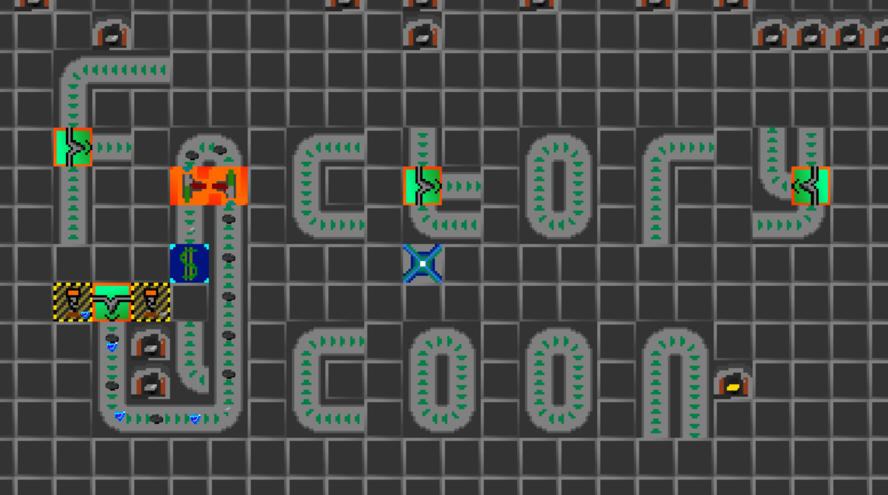

# Factory Tycoon

A python game where you need to manage a hole factory as a tycoon manager.

## Table of content

1. [Dependancies](#dependencies)
2. [A little bit of informations about the code](#notes-about-the-code)
3. [Binds of the game](#binds)
4. [How to play to the game](#launching-the-game)

## Dependencies

- Pygame

## Notes about the code

### Coordonates

When passing coordonates in functions, it coorsponds of the coordonates relatively from the map's center
The only exeption is inside the Map object: the map's matrice requires the coordonates to be absolute.

#### **ABSOLUTE COORDONATES** (*Used inside the Map class only*)

(0, 0)|(0, 1)|(0, 2)
---|---|---
(1, 0)|(1, 1)|(1, 2)
(2, 0)|(2, 1)|(2, 2)

#### **RELATIVE COORDONATES (*Used by all functions*)**

(-1, 1)|(0, 1)|(1, 1)
---|---|---
(-1, 0)|(0, 0)|(1, 0)
(-1, -1)|(0, -1)|(1, -1)

## Game in action

[Here is a video showing me playing the game (in beta mode).](https://cdn.discordapp.com/attachments/1014814644646449160/1115704897023783032/2023-06-06_20-07-01.mp4)

## Binds

### Deplacements

- **`middle_click` + `drag`**: Move the camera in the map
- **`middle_scroll`**: Zoom *in* and *out* (scrolling *upward* or *downward*)

### Map modification

- **`left_click`**: Place the selected block
- **`right_click`**: Remove the target block

### Block modification

- **`a`**: Set the next block's variant (if the block has any variant)
- **`r`**: Rotate the block (if the block is rotable)
- **`e`**: Edit the block behavior (if this functionnality is activated on the block)

### Other

- **`m`**: Open the market GUI
- **`space`**: Place the camera at the map's center

## Launching the game

To launch the game, you must have `python` installed (version **>= 3.11.x**).
Then just start the <ins>`launch.bat`</ins> file at the root of the project.
